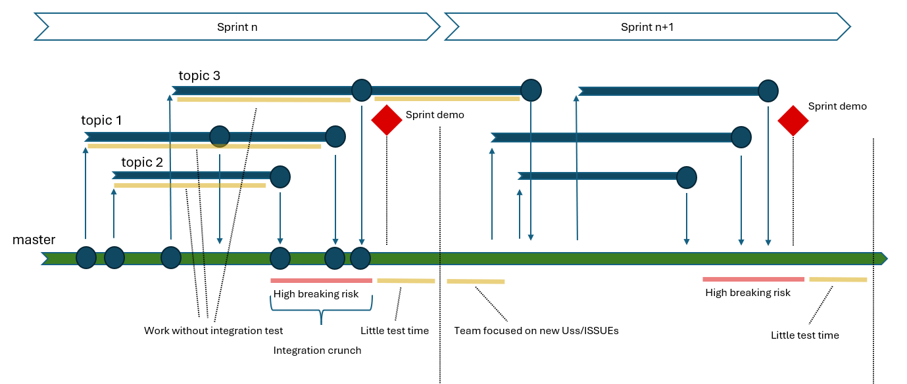
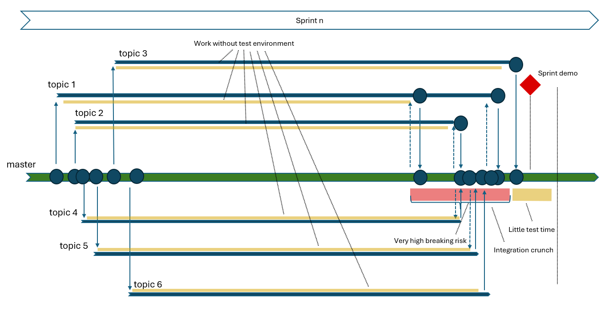
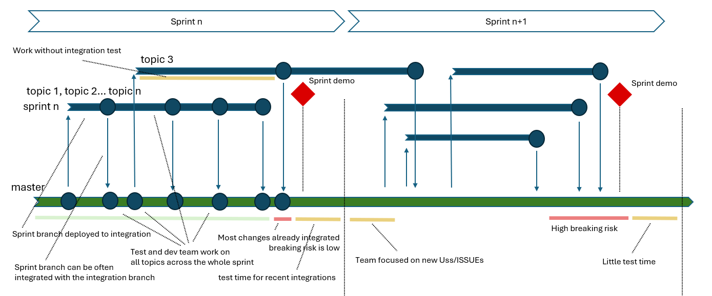
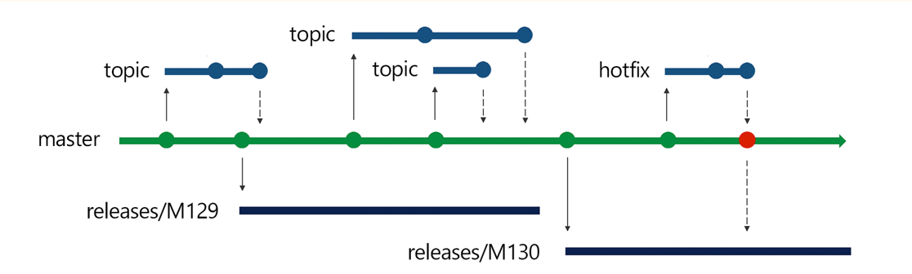
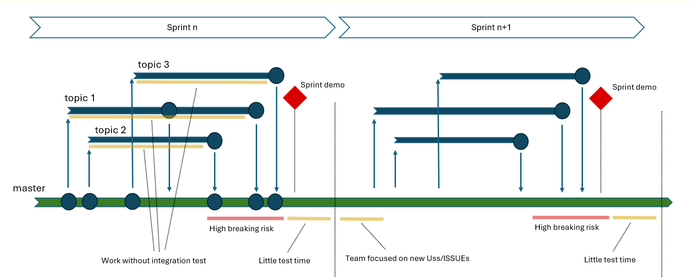
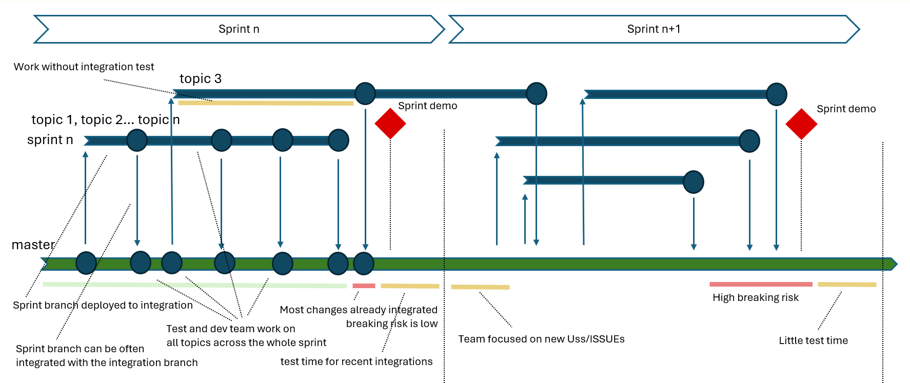
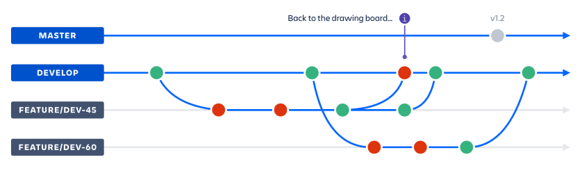
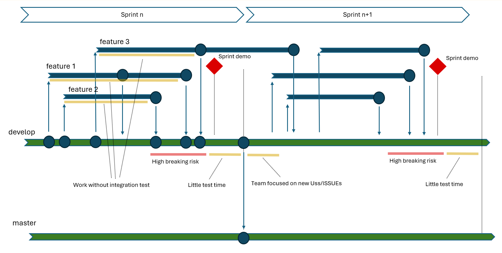
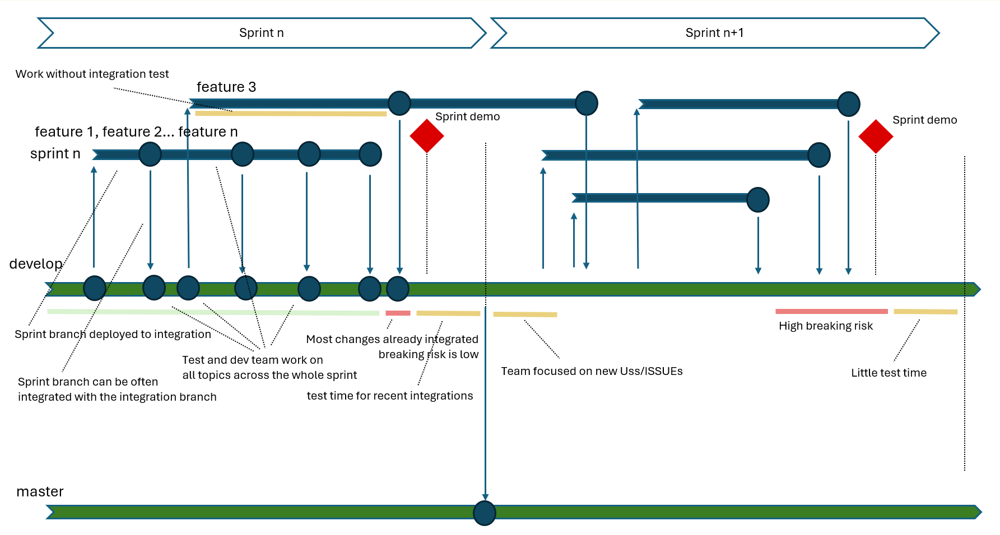

# Overview

In modern Agile Development, teams work in short iterations (__sprints__) to deliver incremental progress.
This involves implementing features, fixing bugs, and __integrating the work of multiple developers by the end of the sprint__. 

A common issue happens when multiple topics are managed by the team on parallel branches where work is integrated late into the sprint timeline.

With such organization, __developers often work alone, on their branches, for most of the sprint duration__ and all the topics are tested with very limited integration with each other. 
The "__integration crunch__" period usually brings high risk of breaking the application. 
__This normally happens late into the sprint__, where only little time  is left for the developer and test team to detect and solve issues. 

Things become even worse in case many topics are managed in short sprints (eg. Two weeks sprints), PR approval is mandatory and PR review is required before merging to master for all the changes. 
__In such cases, integration activities may be further delayed__ and __the integration crunch is even more compressed and pushed to the end of sprint__.

In such condition, __sprint closure may become a complex time__ that jeopardizes the application stability. 
Needless to say the "__sprint demo__" happening exactly in that moment may strongly suffer from that problem.

# Why Risk-Driven Branching
The idea of __Risk-Driven Branching__ is to introduce a pragmatic solution to the problems of late integration and testing by adapting Agile workflows to focus on frequent and progressive integration. 
This strategy can be applied across different branching models; the diagrams we are using are based on __trunk-based development__; we'll later see that the same concepts perfectly apply to other branching strategis such as __GitFlow__ or __Github flow__.

With __Risk-Driven Branching__ most topics development happens on a __single branch dedicated to the sprint__ or __directly on the integration branch__. 
Only for __high breaking risk topics__ a dedicated branch is created.

In this case __only one branch is used for all low breaking risk topics__ and __dedicated branches are chosen for high braking risk topics__ (topic 3, in our example).

The idea here is that for __low breaking risk topics__: 

- __Integration happens immediately__ __across the sprint__ 
- Sprint and integration branches are __integrated with partial implementations across the sprint__
- All the __developer team work together on all topics__
- All test __team works on the environment with all in-progress topics__

For this to work
- __Developers are responsible to commit non breaking changes__ to the sprint or integration branch 
  In case partial topics are committed __Feature flags__ should be available to allow branch release in any moment, at least with partial or untested implementations disabled.
- __In case a breaking change is committed by mistake__ across the sprint, it should be __all team priority detect and solve it__.

Keeping this development approach by "__small non braking changes__" is normally easy for most topics.
In this case, most integration will already be done at sprint end and __merge operations at the end of sprint may become almost irrelevant (and with low risk)__.

# Core Principles of Risk-Driven Branching:
__Core principles__ that guide the __Risk-Driven Branching__ approach include:

1. __Early and Frequent Integration__:
   Most integrations occur progressively throughout the sprint, keeping the codebase up-to-date and minimizing the risk of large-scale conflicts.
2. __Focus on Non-Regression__: Every development step emphasizes maintaining stability and avoiding regressions.
3. __Continuous and anticipated Testing__: Automated tests run on all changes from Day 1, providing instant feedback to developers and testers.
4. __Shared Awareness__: Developers and testers benefit from working on the latest integrated code, fostering collaboration and shared responsibility.
    
This approach effectively mitigates the risks of late integration while enhancing team productivity and code quality.

__Benefits__ of __Risk-Driven Branching__ include:
  1. __Minimized Merge Conflicts__: By integrating frequently, teams avoid the pile-up of changes that lead to complicated conflicts.
  2. __Early Feedback Loop__: Continuous testing and integration ensure developers receive feedback on potential issues early in the sprint.
  3. __Improved Stability__: Regular validation and non-regression testing ensure that the codebase remains stable throughout the sprint.
  4. __Enhanced Collaboration__: Developers can immediately see the impact of others' work, facilitating better coordination and reducing surprises.
  5. __(Last but not least) Boosted Test Team Productivity__:
  Testing happens on progressively refined and later versions of the code, reducing redundancy and increasing efficiency.
    
These advantages make Risk-Driven Branching a robust strategy for Agile teams seeking to balance velocity and reliability.

# Comparing Standard Integration vs. Risk-Driven Branching
The following table summarizes the differences between standard branching and Risk-Driven Branching:
   
| Aspect| Standard branching | Risk-Driven Branching | 
|-----------|-----------|-----------|
| Integration Timing | Happens near the end of the sprint | Happens __progressively throughout sprint__|
| Merge Conflicts | High probability of significant conflicts |__Minimal conflicts__ due to frequent merges|
| Testing Timeline |Minimal testing before sprint ends|Early, continuous __testing from Day 1__|
| Regression Risks |High, due to rushed and incomplete testing|__Lower__, thanks to early validation|
| Team Collaboration |Limited visibility into others' changes|__Immediate feedback__ fosters collaboration|
| __Tester Productivity__ |Limited by late-stage changes|__Boosted__ by working on refined versions|
| __Developer Productivity__ |Limited by working alone on separate branches|__Boosted__ early integration with other developers work|

Risk-Driven Branching reduces risks while enhancing collaboration and productivity for both developers and testers.

# How Risk-Driven Branching Applies to Agile Methodologies
## Trunk-Based Development
All diagram shown up to now applies to Trunk based development.
In this case master branch works as the "Integration" branch where all developers work is integrated.

According to release planning requirements, release branches are taken from master and refined until release conditions are met.

As discussed in the previous chapters, with trunk based development 
The "Integration crunch" can happen at the end of every sprint 

As discussed, risk driven branching can reduce its complexity and risk for the benefit of the team sprint demos and the overall application stability.

## GitFlow Strategy
With Gitflow strategy the "integration" branch is normally named develop and after interation work releases are done to the master branch:

In the chart below you can see Gitflow can suffer from the "__integration crunch__" exactly as other Agile methodologies.

As discussed, __applying Risk-Driven Branching principles, GitFlow__ can benefit from early integration, early test and feedback loop, improved stability and boosted teams productivity.

# Conclusion

Risk-Driven Branching transforms traditional Agile workflows by addressing the critical risks of late integration and testing. 

It empowers teams to:
- __Integrate frequently and progressively__, __minimizing conflicts__ and __improving stability__.
- __Focus on non-regression__ and __maintain a consistently testable and deployable codebase__.
- Enhance collaboration and __productivity__ for both __developers__ and __testers__.

Whether applied to trunk-based development, GitFlow, or other strategies, __Risk-Driven Branching offers a practical and adaptable framework for balancing agility and stability__ in modern software development.

# Reference
[Top 4 Branching Strategies and Their Comparison: A Guide with Recommendations](https://medium.com/novai-devops-101/top-4-branching-strategies-and-their-comparison-a-guide-with-recommendations-21071e1c472a#id_token=eyJhbGciOiJSUzI1NiIsImtpZCI6IjgyMWYzYmM2NmYwNzUxZjc4NDA2MDY3OTliMWFkZjllOWZiNjBkZmIiLCJ0eXAiOiJKV1QifQ.eyJpc3MiOiJodHRwczovL2FjY291bnRzLmdvb2dsZS5jb20iLCJhenAiOiIyMTYyOTYwMzU4MzQtazFrNnFlMDYwczJ0cDJhMmphbTRsamRjbXMwMHN0dGcuYXBwcy5nb29nbGV1c2VyY29udGVudC5jb20iLCJhdWQiOiIyMTYyOTYwMzU4MzQtazFrNnFlMDYwczJ0cDJhMmphbTRsamRjbXMwMHN0dGcuYXBwcy5nb29nbGV1c2VyY29udGVudC5jb20iLCJzdWIiOiIxMDcxNTg2NjkxODgzMjk5MzQzMjkiLCJlbWFpbCI6ImRhcmlvYWlyb2xkaTAwQGdtYWlsLmNvbSIsImVtYWlsX3ZlcmlmaWVkIjp0cnVlLCJuYmYiOjE3NDI5OTM4MTksIm5hbWUiOiJEYXJpbyBBaXJvbGRpIiwicGljdHVyZSI6Imh0dHBzOi8vbGgzLmdvb2dsZXVzZXJjb250ZW50LmNvbS9hL0FDZzhvY0x0YkdZR2hLeDYxRHFoclpja1BrTmxhdUNpYjE3cTI2LXVFeDZCQWVEUS1OTXVhZWs9czk2LWMiLCJnaXZlbl9uYW1lIjoiRGFyaW8iLCJmYW1pbHlfbmFtZSI6IkFpcm9sZGkiLCJpYXQiOjE3NDI5OTQxMTksImV4cCI6MTc0Mjk5NzcxOSwianRpIjoiNjVkNzY4OTcxYzYzYTFmMGZkOWU4NjQwNzQ1ZDFiNGUxNzdjYzdlMiJ9.gHe-UAQiVuMYJHu2se_JjhrkirmsP66acZjJciBRmAA05Q2aq-esf7VAS19ZexnvsAeX3G8xe1lMOkgyh8R815pY0vPbbr9TEKobpo353PWgAxiO8evkSKCSkOOM5JQqRRfigmxJsBzhBXA23-zZ-fZIPyUinOY8E6ViTV5HISukKX2pxZo4bV56Xl6a-0gzKaCKib0R1zxWa4s6Ii-mokX4fBbhZZgYMTahTEgdf3hODnTu5KXPxz3huZmp0G0lVIwt_kBaNuWOgH7ZhksCTMk4w32K4IDFCpxOWXK-jKINLYRJZSQvYse4e9735-snG43zH8B2Gyze8PGybR7Uew)

